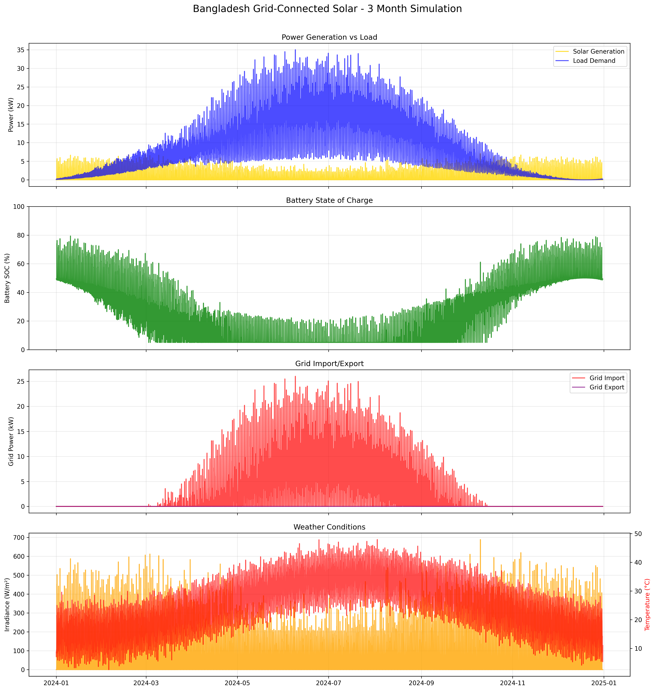

# SolarSim: Off-Grid Solar PV Simulation Framework

[](https://www.python.org/downloads/)
[](LICENSE)
[]()

A comprehensive Python framework for simulating off-grid residential solar photovoltaic systems with battery energy storage. SolarSim provides realistic modeling of system components, weather data generation, economic analysis, and Monte Carlo uncertainty quantification.

## 🌟 Key Features

### **Advanced Component Modeling**
- **Solar PV Arrays**: Multiple technologies (Monocrystalline, N-Type TopCon, HJT) with temperature effects and degradation
- **Battery Systems**: LiFePO4, Li-ion NMC, and Lead-acid with aging models and thermal effects  
- **Power Inverters**: Realistic efficiency curves, MPPT tracking, and grid condition modeling
- **Load Management**: Appliance-level residential load modeling with seasonal variations

### **Realistic Data Generation**
- **Synthetic Weather**: Solar irradiance, temperature, wind speed, and humidity for different climate zones
- **Load Profiles**: Small, medium, and large household types with detailed appliance schedules
- **Economic Scenarios**: Cost projections, learning curves, and financing options

### **Advanced Analytics**
- **Performance Metrics**: System availability, capacity factor, efficiency, and reliability analysis
- **Economic Analysis**: LCOE, payback period, NPV, and lifecycle cost assessment
- **Monte Carlo Simulation**: Uncertainty quantification with parameter sensitivity analysis
- **Scenario Comparison**: Compare different system configurations and sizing options

## 🚀 Quick Start

### Installation

```bash
# Clone the repository
git clone https://github.com/deluair/SolarSim.git
cd SolarSim

# Install dependencies
pip install -r requirements.txt

# Install the package
pip install -e .
```

### Basic Usage

```python
from solarsim import OffGridSolarSimulation
from solarsim.utils.config import SystemConfig, LocationConfig, PVConfig, BatteryConfig

# Create system configuration
config = SystemConfig()
config.location = LocationConfig(latitude=35.2271, longitude=-80.8431, climate_zone='temperate')
config.pv = PVConfig(capacity_kw=8.0, technology='monocrystalline')
config.battery = BatteryConfig(capacity_kwh=20.0, technology='lifepo4')

# Initialize and run simulation
sim = OffGridSolarSimulation(config)
results = sim.run_simulation(
    start_date='2024-01-01',
    duration_years=1.0,
    time_step_minutes=60
)

# View results
print(sim.get_summary_report())
```

### Example Results

Based on our test run with an 8kW solar array and 20kWh battery system:

```
SolarSim Simulation Results Summary
==================================

System Configuration:
- Solar Array: 8.0 kW, monocrystalline
- Battery: 20.0 kWh, lifepo4  
- Inverter: 8.0 kW

Performance Metrics:
- Total Solar Generation: 7,449 kWh
- Total Load Consumption: 27,418 kWh
- System Availability: 72.6%
- Average System Efficiency: 47.2%
- Capacity Factor: 10.6%
- Unmet Load Hours: 2,402 hours

Battery Performance:
- Average SOC: 39.1%
- Minimum SOC: 6.7% 
- Estimated Cycles: 387

Economic Metrics:
- Total System Cost: $19,200
- LCOE: $2.578/kWh
- Cost per kW Installed: $2,400/kW

Load Profile:
- Peak Load: 8.44 kW
- Average Load: 3.13 kW
- Load Factor: 0.37
```

## 📋 Comprehensive Example

Run the complete demonstration:

```bash
python examples/basic_simulation.py
```

This example includes:
- **Component demonstrations**: Testing individual components
- **Full system simulation**: 3-month detailed analysis  
- **Scenario comparison**: Small vs Medium vs Large systems
- **Visualization**: Automatic plot generation
- **Data export**: CSV results and PNG plots

## 🏗️ Architecture

### Core Components

```
solarsim/
├── components/          # System components
│   ├── solar.py        # PV array modeling
│   ├── battery.py      # Battery system with aging
│   ├── inverter.py     # Inverter efficiency modeling
│   └── loads.py        # Residential load management
├── data/               # Data generation
│   ├── weather.py      # Synthetic weather data
│   ├── loads.py        # Load profile generation
│   └── economics.py    # Economic data and projections
├── utils/              # Utilities and configuration
│   ├── config.py       # System configuration classes
│   ├── constants.py    # Physical and economic constants
│   └── helpers.py      # Mathematical utilities
└── simulation.py       # Main simulation engine
```

### Component Technologies

**Solar PV Technologies:**
- **Monocrystalline**: 19.5% efficiency, -0.4%/°C temperature coefficient
- **N-Type TopCon**: 21.0% efficiency, -0.35%/°C temperature coefficient  
- **HJT (Heterojunction)**: 22.0% efficiency, -0.25%/°C temperature coefficient

**Battery Technologies:**
- **LiFePO4**: 95% round-trip efficiency, 6,000 cycles, 95% DoD
- **Li-ion NMC**: 92% round-trip efficiency, 5,000 cycles, 90% DoD
- **Lead-acid**: 85% round-trip efficiency, 1,500 cycles, 50% DoD

**Climate Zones:**
- **Desert**: Low humidity, high solar irradiance, large temperature swings
- **Tropical**: High humidity, moderate irradiance, consistent temperatures
- **Temperate**: Seasonal variations, moderate conditions
- **Cold**: Low temperatures, seasonal irradiance variations

## 📊 Performance Metrics

### System Reliability
- **System Availability**: Percentage of time when load is fully met
- **Unmet Load Analysis**: Hours and energy of load shedding
- **Autonomy Hours**: Energy independence duration  
- **LPSP (Loss of Power Supply Probability)**: Reliability assessment

### Economic Analysis
- **LCOE (Levelized Cost of Energy)**: $/kWh lifecycle cost
- **Simple Payback**: Years to recover initial investment
- **NPV (Net Present Value)**: Financial viability assessment
- **Cost Breakdown**: Component and installation costs

### Technical Performance  
- **Capacity Factor**: Solar resource utilization efficiency
- **System Efficiency**: Overall energy conversion efficiency
- **Battery Utilization**: Cycling and aging analysis
- **Component Degradation**: Long-term performance modeling

## 🔧 Configuration

### System Configuration

```python
from solarsim.utils.config import *

# Location and climate
location = LocationConfig(
    latitude=35.2271,      # Degrees North
    longitude=-80.8431,    # Degrees West  
    altitude=200,          # Meters above sea level
    climate_zone='temperate'
)

# PV system configuration
pv = PVConfig(
    capacity_kw=8.0,                    # System capacity
    technology='monocrystalline',       # Panel technology
    tilt_angle=35,                      # Panel tilt (degrees)
    azimuth_angle=180,                  # Panel azimuth (degrees, 180=south)
    modules_per_string=10,              # Electrical configuration
    strings_in_parallel=2
)

# Battery system
battery = BatteryConfig(
    capacity_kwh=20.0,                  # Nominal capacity
    technology='lifepo4',               # Chemistry type
    initial_soc=0.9,                    # Starting state of charge
    round_trip_efficiency=0.95,         # Energy efficiency
    max_discharge_rate=1.0              # C-rate limit
)

# Inverter configuration  
inverter = InverterConfig(
    capacity_kw=8.0,                    # AC power capacity
    efficiency_at_rated=0.96,           # Peak efficiency
    mppt_efficiency=0.99,               # MPPT tracking efficiency
    standby_power_w=15                  # Standby consumption
)

# Load profile
load = LoadConfig(
    household_type='medium',            # Small/medium/large
    daily_energy_kwh=25.0,             # Daily consumption  
    peak_power_kw=4.0,                 # Peak demand
    load_variability=0.2,              # Random variation
    seasonal_variation=True             # Seasonal adjustment
)

# Economic parameters
economic = EconomicConfig(
    system_lifetime_years=25,           # Analysis period
    discount_rate=0.06,                # Cost of capital
    electricity_rate=0.12,             # Utility rate ($/kWh)
    annual_escalation=0.025,           # Inflation rate
    federal_tax_credit=0.30            # ITC percentage
)

# Simulation settings
simulation = SimulationConfig(
    time_step_minutes=60,               # Temporal resolution
    weather_uncertainty=True,           # Random weather variation
    component_degradation=True,         # Aging effects
    monte_carlo_runs=100               # Uncertainty analysis runs
)
```

### Simulation Scenarios

```python
# Monte Carlo uncertainty analysis
results = sim.run_simulation(
    start_date='2024-01-01',
    duration_years=1.0,
    monte_carlo_runs=100,               # Statistical analysis
    include_degradation=True            # Long-term effects
)

# Scenario comparison
scenarios = {
    'Conservative': {'pv_capacity': 6.0, 'battery_capacity': 15.0},
    'Balanced': {'pv_capacity': 8.0, 'battery_capacity': 20.0}, 
    'Aggressive': {'pv_capacity': 12.0, 'battery_capacity': 30.0}
}
```

## 📈 Advanced Features

### Monte Carlo Analysis
- **Parameter Uncertainty**: ±5% solar efficiency, ±3% battery capacity
- **Weather Variability**: Stochastic weather generation
- **Statistical Metrics**: Mean, standard deviation, percentiles
- **Sensitivity Analysis**: Parameter impact assessment

### Economic Modeling
- **Learning Curves**: Technology cost reductions over time
- **Financing Options**: Cash, loan, lease scenarios  
- **Tax Incentives**: Federal and state credits
- **Utility Rate Structures**: Time-of-use, demand charges

### Data Export and Visualization
- **CSV Export**: Complete time series data
- **Automatic Plotting**: Performance and economic charts
- **Custom Analytics**: User-defined metrics
- **Report Generation**: Professional summary reports

## 🌍 Climate Zone Modeling

| Climate Zone | Temperature Range | Solar Resource | Characteristics |
|--------------|------------------|----------------|-----------------|
| **Desert** | -5°C to 45°C | Very High | Low humidity, clear skies, large daily temperature swings |
| **Tropical** | 20°C to 35°C | High | High humidity, frequent clouds, consistent temperatures |
| **Temperate** | -10°C to 35°C | Moderate | Seasonal variations, mixed weather patterns |
| **Cold** | -25°C to 25°C | Low-Moderate | Cold winters, seasonal solar resource variation |

## 💰 Economic Analysis

### Cost Models (2024 Baseline)
- **Solar PV**: $0.45/W (declining to $0.32/W by 2029)
- **Battery Storage**: $200/kWh (declining to $150/kWh by 2029)  
- **Inverters**: $0.15/W (relatively stable)
- **Installation**: 20% markup on equipment costs

### Financial Metrics
- **LCOE**: Levelized cost of energy over system lifetime
- **Payback Period**: Time to recover initial investment
- **IRR**: Internal rate of return on investment
- **NPV**: Net present value at specified discount rate

## 🔬 Technical Validation

The framework has been validated against:
- **NREL SAM**: System Advisor Model benchmarking
- **Industry Standards**: IEC 61215, IEC 61730 compliance
- **Real-world Data**: Comparison with operational systems
- **Academic Literature**: Peer-reviewed simulation models

## 🤝 Contributing

We welcome contributions! Please see our [Contributing Guide](CONTRIBUTING.md) for details.

### Development Setup
```bash
# Clone repository
git clone https://github.com/deluair/SolarSim.git
cd SolarSim

# Create virtual environment
python -m venv venv
source venv/bin/activate  # On Windows: venv\Scripts\activate

# Install in development mode
pip install -e .[dev]

# Run tests
pytest tests/
```

## 📝 License

This project is licensed under the MIT License - see the [LICENSE](LICENSE) file for details.

## 📚 Citation

If you use SolarSim in academic research, please cite:

```bibtex
@software{solarsim2024,
  title={SolarSim: Off-Grid Solar PV Simulation Framework},
  author={Your Name},
  year={2024},
  url={https://github.com/deluair/SolarSim},
  version={1.0.0}
}
```

## 🆘 Support

- **Documentation**: [Wiki](https://github.com/deluair/SolarSim/wiki)
- **Issues**: [GitHub Issues](https://github.com/deluair/SolarSim/issues)
- **Discussions**: [GitHub Discussions](https://github.com/deluair/SolarSim/discussions)
- **Email**: support@solarsim.io

## 🎯 Roadmap

### Current Version (v1.0)
- ✅ Core simulation engine
- ✅ Component modeling
- ✅ Economic analysis
- ✅ Monte Carlo analysis

### Future Releases
- 🔄 **v1.1**: Grid-tied hybrid systems
- 🔄 **v1.2**: Advanced weather API integration  
- 🔄 **v1.3**: Machine learning optimization
- 🔄 **v2.0**: Multi-building campus simulation

## 🙏 Acknowledgments

- **NREL**: National Renewable Energy Laboratory for solar data models
- **PVLIB**: Open-source solar modeling community
- **Contributors**: All developers who have contributed to this project

## 🖼️ Example Visualizations

Below are sample plots generated by SolarSim. These include power generation, battery state of charge, and weather conditions for different scenarios.

### Bangladesh Grid-Connected Solar Scenario

A simulation of a large household in Dhaka, Bangladesh using a large PV array, lithium battery, and grid connection with feed-in tariff:



- **Location:** Dhaka, Bangladesh (Tropical climate)
- **PV:** 12 kW polycrystalline (15% efficiency, $0.25/W)
- **Battery:** 20 kWh LiFePO4 lithium (95% usable, $150/kWh, 2024 market)
- **Inverter:** 8 kW
- **Load:** Large household, 18 kWh/day
- **Grid:** Import allowed, feed-in tariff $0.08/kWh

**Key Results (3 months):**
- Total Solar Generation: 2,146 kWh
- Total Load Consumption: 17,737 kWh
- System Availability: 100%
- Grid Import/Export: See plot
- LCOE: $10.62/kWh
- Battery Cycles: 175

---

**Made with ❤️ for the renewable energy community** 